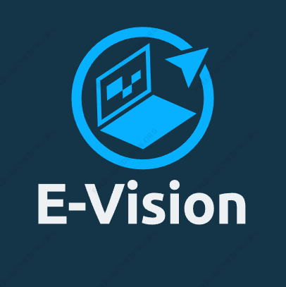

<!-- Adicione Badges das tecnologias que você usou aqui -->
<!-- Você pode encontrar badges aqui: https://github.com/Ileriayo/markdown-badges?tab=readme-ov-file#markdown-badges -->

**Este projeto foi desenvolvido como atividade final do curso de capacitação em Python da Cyber Edux, realizado de setembro de 2023 até março de 2024. Para mais informações, consulte o [enunciado](ENUNCIADO.md).**

# E-Vision

<!-- Substitua a seguinte imagem por uma logo do seu projeto -->

<!-- Substitua o seguinte parágrafo por um resumo do seu projeto: -->
E-Vision é um sistema de gestão acadêmica com recursos únicos onde é gerenciar cursos e disciplinas cadastradas, bem como alunos, usuários do sistema e professores. O sistema permite dois tipos de usuário: Professor e Administrador do sistema. O sistema também apresenta recursos de CRUD e uma seção para administradores onde é possível ter uma visão geral da situação da instituição por meio de gráficos que trazem métricas sobre os cursos, disciplinas e alunos.

## Documentação

* [Documentação (para desenvolvedores)](DOCUMENTACAO.md)
* [Manual (para usuários)](MANUAL.md)

## Sobre o autor

<!-- Coloque seu nome, uma foto sua e uma pequena bio sobre você na seguinte tabela: -->
|  |  |
|:-------------:|:------------------------------------------------------------:|
|    **João Oliveira** | Meu nome é João Oliveira, sou estudante de Ciência da Computação, autodidata e apaixonado por tecnologia. Atualmente focado no desenvolvimento Web, utilizo tecnologias como Javascript, Python, Django, Node.js e Postgresql. Estou sempre buscando me aperfeiçoar. |
